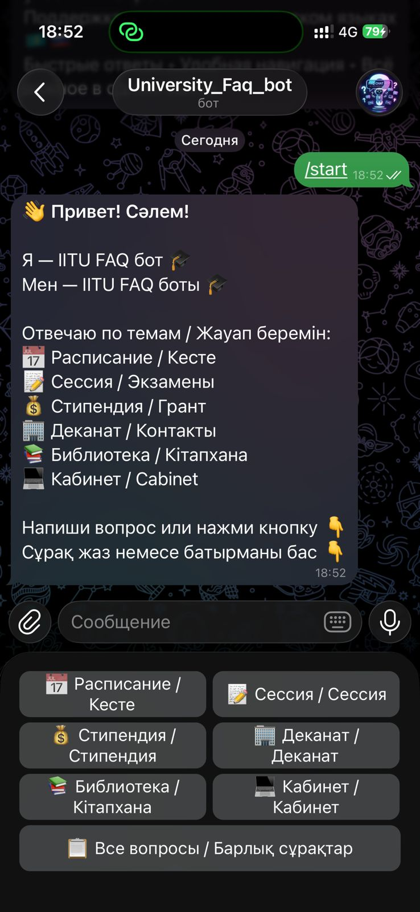
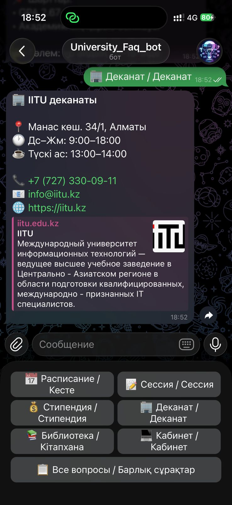
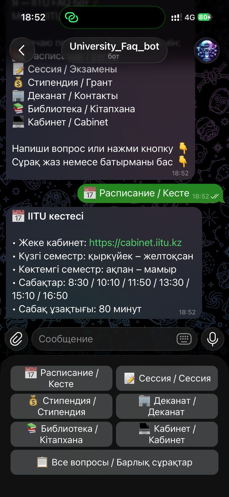

# 🎓 IITU FAQ Telegram Bot

> Университет IITU бойынша жиі қойылатын сұрақтарға автоматты жауап беретін Telegram бот.
> Автоматический Telegram-бот для ответов на часто задаваемые вопросы об университете IITU.

---

## 📌 1. Название проекта

**IITU FAQ Чат-Бот** — FAQ-чат-бот на основе заранее заданного словаря вопросов и ответов об университете IITU (Международный университет информационных технологий, Алматы).

---

## 📖 2. Описание проекта

Этот проект представляет собой Telegram-бота, который отвечает на часто задаваемые вопросы студентов университета IITU. Бот использует заранее заданный словарь вопросов и ответов, автоматически определяет язык пользователя (русский или казахский) и отвечает на соответствующем языке.

### Что умеет бот:
- 📅 Информация о расписании занятий
- 📝 Информация о сессии и экзаменах
- 💰 Информация о стипендии и грантах
- 🏢 Контакты и режим работы деканата
- 📚 Информация о библиотеке
- 💻 Помощь с личным кабинетом
- 📄 Как получить справку
- 👨‍🏫 Информация о кураторе
- 🏠 Общежитие
- 🎓 Специальности университета
- 📶 Подключение к Wi-Fi

### Особенности:
- ✅ Поддержка **двух языков**: русский и казахский
- ✅ Автоматическое **определение языка** по тексту
- ✅ Удобные **кнопки быстрых ответов**
- ✅ Интеграция с **Django** для управления данными
- ✅ **Админ-панель** Django для редактирования FAQ

---

## 🛠️ 3. Используемые технологии

| Технология | Версия | Назначение |
|---|---|---|
| Python | 3.9+ | Основной язык программирования |
| Django | 4.2.30 | База данных и админ-панель |
| python-telegram-bot | 22.5 | Telegram Bot API |
| python-dotenv | 1.2.1 | Хранение секретных данных (.env) |
| SQLite | встроен | База данных |
| VS Code | latest | Среда разработки |

---

## ⚙️ 4. Инструкция по установке

### Шаг 1 — Клонировать или скачать проект

```bash
# Создать папку
mkdir telegram_bot
cd telegram_bot
```

### Шаг 2 — Создать виртуальное окружение

```bash
python3 -m venv venv
source venv/bin/activate   # Mac/Linux
```

### Шаг 3 — Установить зависимости

```bash
pip install django python-telegram-bot python-dotenv
```

### Шаг 4 — Создать Django проект

```bash
django-admin startproject config .
python3 manage.py startapp bot
```

### Шаг 5 — Настроить config/settings.py

Найти `INSTALLED_APPS` и добавить `'bot'`:

```python
INSTALLED_APPS = [
    'django.contrib.admin',
    'django.contrib.auth',
    'django.contrib.contenttypes',
    'django.contrib.sessions',
    'django.contrib.messages',
    'django.contrib.staticfiles',
    'bot',  # ← добавить эту строку
]
```

### Шаг 6 — Создать файл .env

```bash
touch .env
```

Открыть `.env` и добавить токен бота:

```
TELEGRAM_TOKEN=ваш_токен_от_BotFather
```

> 💡 Токен получить у @BotFather в Telegram: /newbot

### Шаг 7 — Создать базу данных

```bash
python3 manage.py makemigrations
python3 manage.py migrate
```

### Шаг 8 — Создать администратора

```bash
python3 manage.py createsuperuser
```

Ввести: логин, email (можно пропустить), пароль

---

## 🚀 5. Инструкция по запуску

### Запуск Django сервера (Терминал 1)

```bash
cd /Users/ваше_имя/telegram_bot
source venv/bin/activate
python3 manage.py runserver
```

Открыть в браузере: **http://127.0.0.1:8000/admin**

### Запуск Telegram бота (Терминал 2)

```bash
cd /Users/ваше_имя/telegram_bot
source venv/bin/activate
python3 bot/bot.py
```

Если увидели:
```
✅ IITU FAQ Bot іске қосылды!
```
— бот работает! Открыть Telegram и написать `/start`

### Структура файлов

```
telegram_bot/
├── bot/
│   ├── migrations/      ← миграции Django
│   ├── __init__.py
│   ├── admin.py         ← регистрация модели в админке
│   ├── apps.py
│   ├── bot.py           ← основной код бота ⭐
│   ├── models.py        ← модель FAQ базы данных
│   └── views.py
├── config/
│   ├── __init__.py
│   ├── settings.py      ← настройки Django
│   ├── urls.py          ← маршруты
│   └── wsgi.py
├── venv/                ← виртуальное окружение
├── .env                 ← секретный токен
├── db.sqlite3           ← база данных
└── manage.py            ← команды Django
```

---

## 💬 6. Примеры работы чат-бота

### Пример 1 — Команда /start

```
Пользователь: /start

Бот: 👋 Привет! Сәлем!

Я — IITU FAQ бот 🎓
Мен — IITU FAQ боты 🎓

Жауап беретін тақырыптар / Отвечаю по темам:
📅 Кесте / Расписание
📝 Сессия / Экзамены
💰 Стипендия / Грант
🏢 Деканат / Контакты
📚 Библиотека / Кітапхана
💻 Кабинет / Cabinet

[Кнопки: 📅 Расписание / Кесте | 📝 Сессия / Сессия]
[💰 Стипендия / Стипендия | 🏢 Деканат / Деканат]
```

---

### Пример 2 — Вопрос о расписании (на русском)

```
Пользователь: расписание

Бот: 📅 Расписание IITU

• Проверить расписание: https://cabinet.iitu.kz
• Войдите в личный кабинет → Расписание
• Осенний семестр: сентябрь – декабрь
• Весенний семестр: февраль – май
• Пары начинаются в 8:30, 10:10, 11:50, 13:30, 15:10, 16:50
• Длительность пары: 80 минут
```

---

### Пример 3 — Вопрос о кесте (на казахском)

```
Пользователь: кесте қайдан тексеремін

Бот: 📅 IITU кестесі

• Кестені тексеру: https://cabinet.iitu.kz
• Жеке кабинетке кіріңіз → Кесте
• Күзгі семестр: қыркүйек – желтоқсан
• Сабақ басталу уақыты: 8:30, 10:10, 11:50, 13:30, 15:10, 16:50
• Сабақ ұзақтығы: 80 минут
```

---

### Пример 4 — Вопрос о стипендии

```
Пользователь: стипендия когда

Бот: 💰 Стипендия в IITU

📌 Государственный грант:
• Академическая стипендия: ~36 000 тг/мес
• Социальная стипендия: ~50 000 тг/мес
• Повышенная стипендия (GPA 3.5+): ~54 000 тг/мес

📌 Условия получения:
• Средний балл GPA не ниже 2.67
• Нет академических долгов
• Учиться на гранте

📌 Выплата: 10-15 числа каждого месяца
```

---

### Пример 5 — Вопрос о сессии

```
Пользователь: сессия қашан

Бот: 📝 IITU сессиясы

• Қысқы сессия: қаңтар (1-3 апта)
• Жазғы сессия: мамыр-маусым
• Емтихан кестесі: cabinet.iitu.kz
• Емтиханға жіберу: қатысу 70%-дан кем болмауы керек
• Қайта тапсыру: сессиядан кейін 2 апта ішінде

⚠️ 3+ қарыз болса — шығарылу!
```

---

### Пример 6 — Неизвестный вопрос

```
Пользователь: футбол алаңы қайда

Бот: 🤔 Сұрақты түсінбедім.

Төмендегі тақырыптарды жазып көр:
• кесте
• сессия
• стипендия
• деканат
• библиотека
• кабинет
• справка
• куратор

Немесе /help командасын жіберіңіз.
```

---

## 👨‍💻 Авторы

| Имя | Роль |
|---|---|
| Musilim | Backend разработчик (Python, Django, Bot) |

---

## 📞 Контакты IITU

- 🌐 Сайт: https://iitu.kz
- 💻 Кабинет: https://cabinet.iitu.kz
- 📧 Email: info@iitu.kz
- 📞 Тел: +7 (727) 330-09-11
- 📍 Адрес: ул. Манаса 34/1, Алматы

---
## 📸 7. Скриншоты интерфейса

### /start команда


### Расписание жауабы


### Стипендия жауабы


### Help команда


*Жоба IITU университетінің студенттері үшін жасалған / Проект создан для студентов университета IITU*